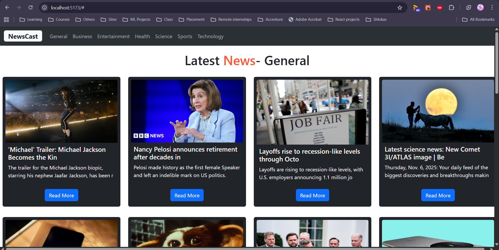
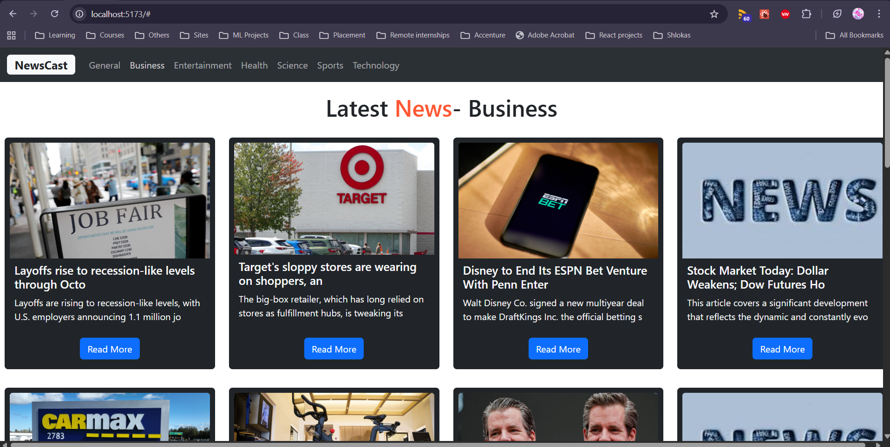
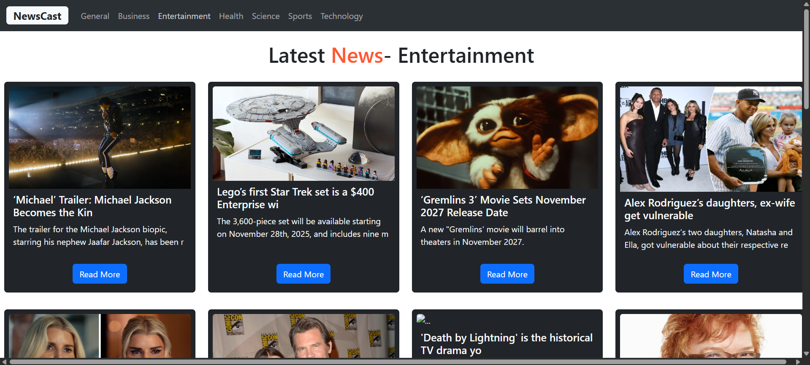
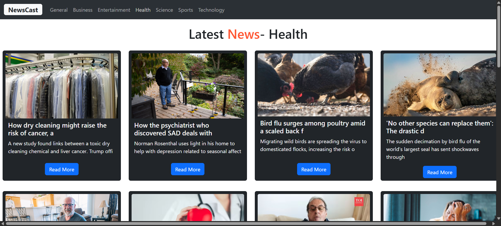
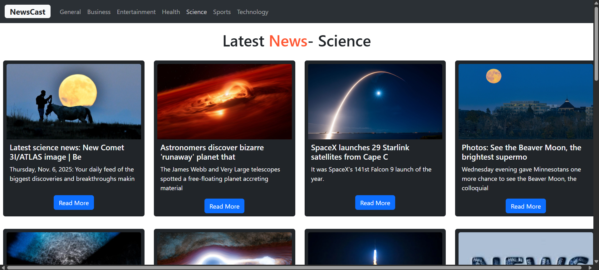
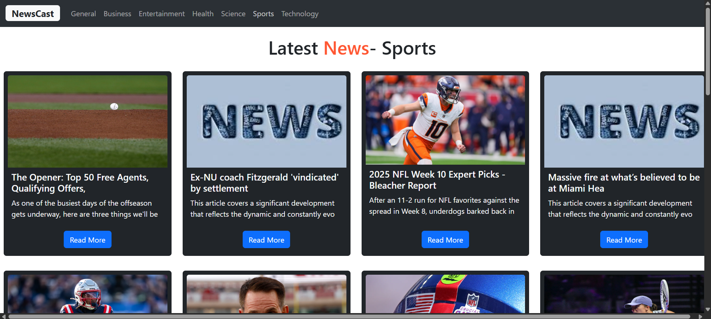
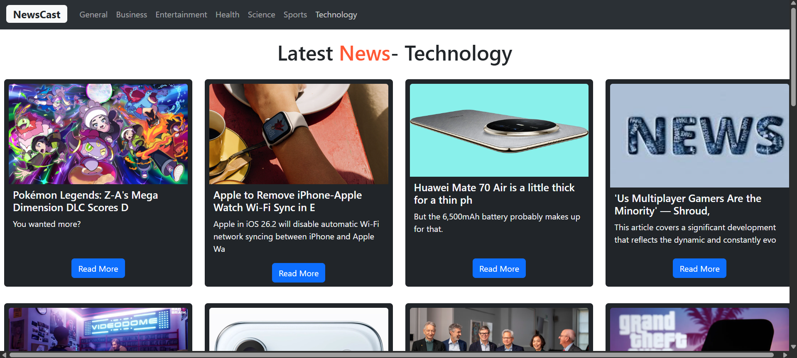

# Introduction

This project is a dynamic News Web Application built with React.js. It shows the latest breaking news in various categories like business, technology, sports, entertainment, and more. It uses the NewsAPI service to fetch real-time headlines and displays them in an interactive and responsive card layout.

Each news card includes the article’s title, image, brief description, and a "Read More" link to the full story. To provide a smooth experience without errors, the application uses custom fallback images and descriptions whenever the API response is missing them. This makes the app reliable, visually consistent, and easy to use, even when data is incomplete.

The interface is styled with Bootstrap for a clean, modern look. React hooks like useState and useEffect manage state and API calls efficiently.

## Running this application

1. Clone the repository or Download the ZIP file
2. Navigate into the project
3. Install dependencies: npm install
4. Create your API key in this website: "https://newsapi.org/"
5. Paste your API key in .env file.
4. Start the development server: npm run dev

## Images

## Error Handling

